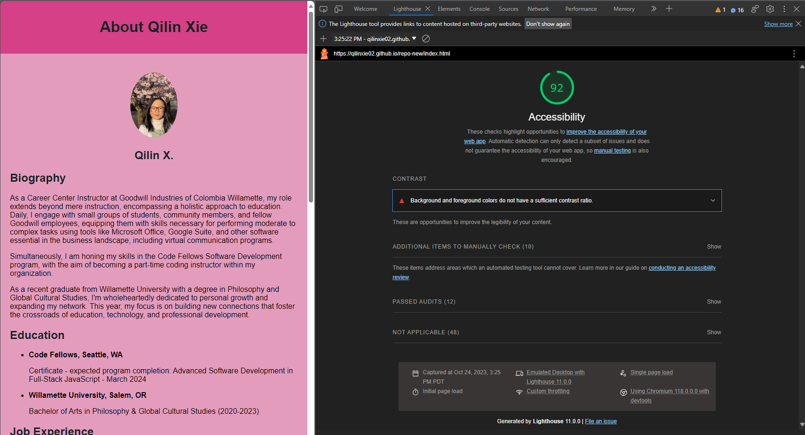
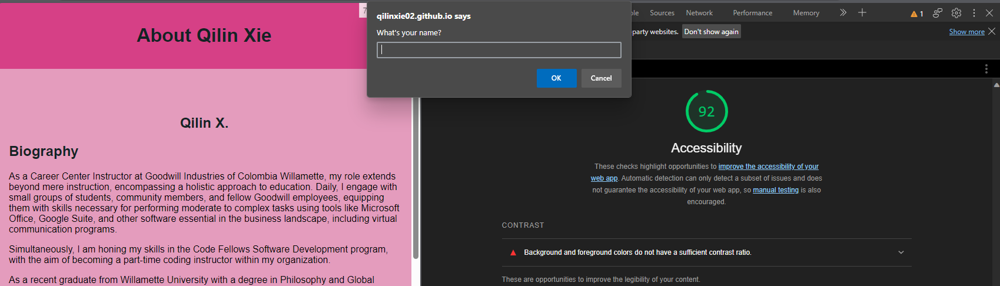

# repo-new
- As a site owner, I am adding my "top ten" places to visit so users can learn more about me. 

- As a site owner, I am making people guess the number between 1-`0. They can have 4 attempts.  

- As a site owner, I am making people guess my favorite fruits/veggies, they have 6 attempts before the corrected answers.  

- As a site owner, I am letting them know how many questions they've gotten correct out of 7 

update: 1:48 10/25/23

1st scrrensoht for lab 2

2nd screenshot for lab 3

10/26. This is Meg, I was the driver to Qilin's Code. We worked on the JS files to create functions and increase the readibility of code.